# 🌙 Sleep Health and Lifestyle - Exploratory Data Analysis


**Course:** CS 661 – Python Programming  
**Institution:** Pace University  
**Team:** Group 3  
**Date:** Fall 2025

---

## 📋 Table of Contents
- [Project Overview](#-project-overview)
- [System Architecture](#-system-architecture)
- [Data Flow](#-data-flow)
- [Analysis Workflow](#-analysis-workflow)
- [Key Findings](#-key-findings)
- [Dataset Information](#-dataset-information)
- [Getting Started](#-getting-started)
- [Visualizations](#-visualizations)
- [Results](#-results)
- [Team](#-team-contributions)

---

## 📊 Project Overview

This project performs comprehensive Exploratory Data Analysis (EDA) on the Sleep Health and Lifestyle dataset to understand factors affecting sleep quality and identify patterns in sleep disorders, lifestyle habits, and health metrics.

### 🎯 Objectives
- 📈 Analyze sleep patterns and quality across demographics
- 🔗 Identify relationships between lifestyle factors and sleep
- 💊 Examine health metrics and their correlations
- 💡 Provide insights and recommendations for better sleep health

---

## 🏗️ System Architecture

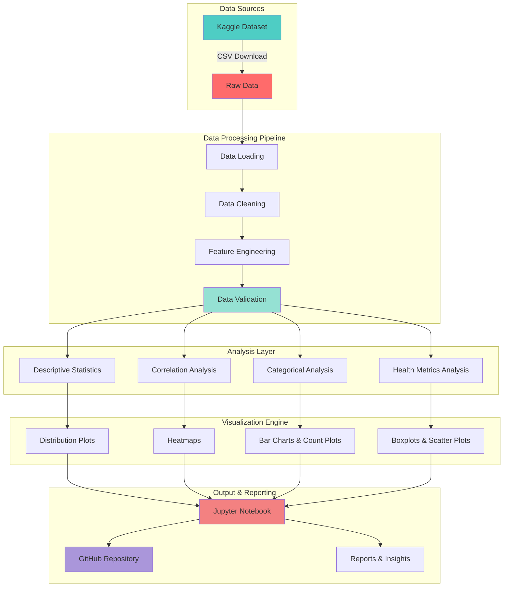

---

## 🔄 Data Flow

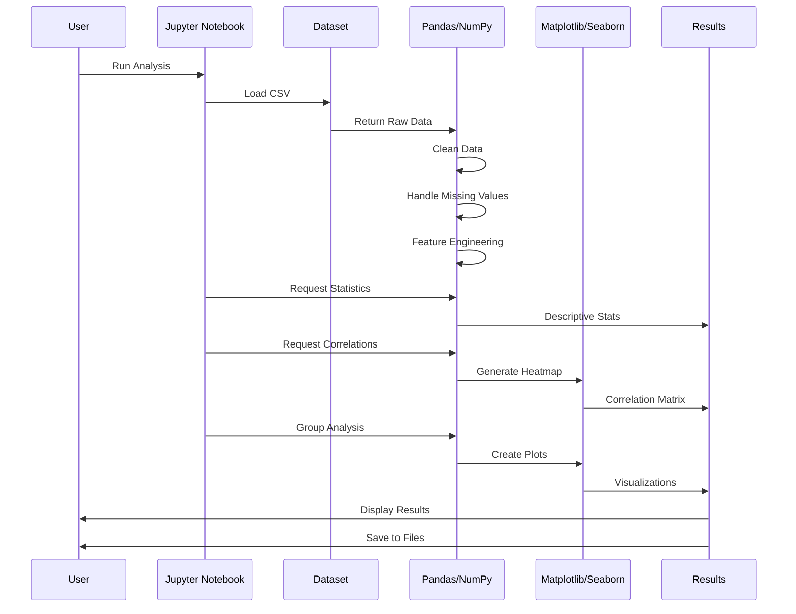

---

## 🔬 Analysis Workflow

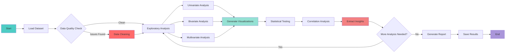

---

## 📁 Repository Structure

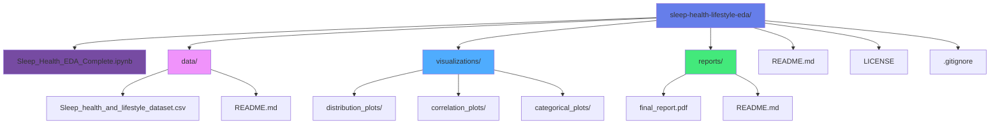

---

## 📊 Dataset Information

**Source:** [Kaggle - Sleep Health and Lifestyle Dataset](https://www.kaggle.com/datasets/uom190346a/sleep-health-and-lifestyle-dataset)

**Size:** 374 records × 13 features

### Features Overview

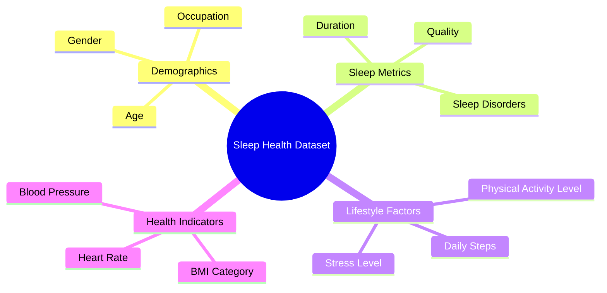

---

## 🔍 Key Findings

### Sleep Patterns Insights

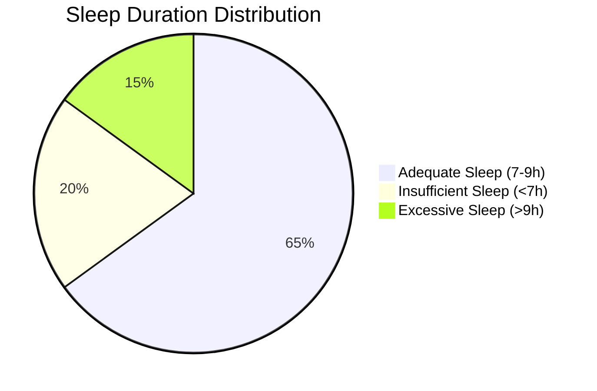

### Health Correlations

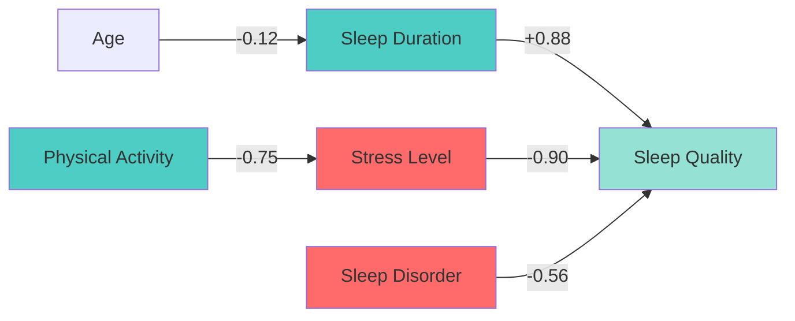

### Key Statistics
- **Average Sleep Duration:** ~7.1 hours
- **Average Sleep Quality:** 7-8/10
- **Population with Sleep Disorders:** 40-45%
- **Individuals with Adequate Sleep:** 60-70%

---

## 🚀 Getting Started

### Prerequisites
```bash
Python 3.8+
pandas >= 1.5.3
numpy >= 1.24.3
matplotlib >= 3.7.1
seaborn >= 0.12.2
scikit-learn >= 1.2.2
jupyter >= 1.0.0
```

### Installation

1. **Clone the repository:**
```bash
git clone https://github.com/Prani897/sleep-health-lifestyle-eda.git
cd sleep-health-lifestyle-eda
```

2. **Create virtual environment (optional but recommended):**
```bash
python -m venv venv
source venv/bin/activate  # On Windows: venv\Scripts\activate
```

3. **Install dependencies:**
```bash
pip install -r requirements.txt
```

4. **Launch Jupyter Notebook:**
```bash
jupyter notebook Sleep_Health_EDA_Complete.ipynb
```

**Or open directly in Google Colab:**

[](https://colab.research.google.com/github/Prani897/sleep-health-lifestyle-eda/blob/main/Sleep_Health_EDA_Complete.ipynb)

---

## 📊 Visualizations

The analysis includes 15+ professional visualizations:

### Visualization Categories

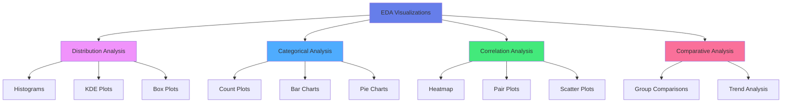

---

## 📈 Analysis Methodology

### Data Processing Pipeline

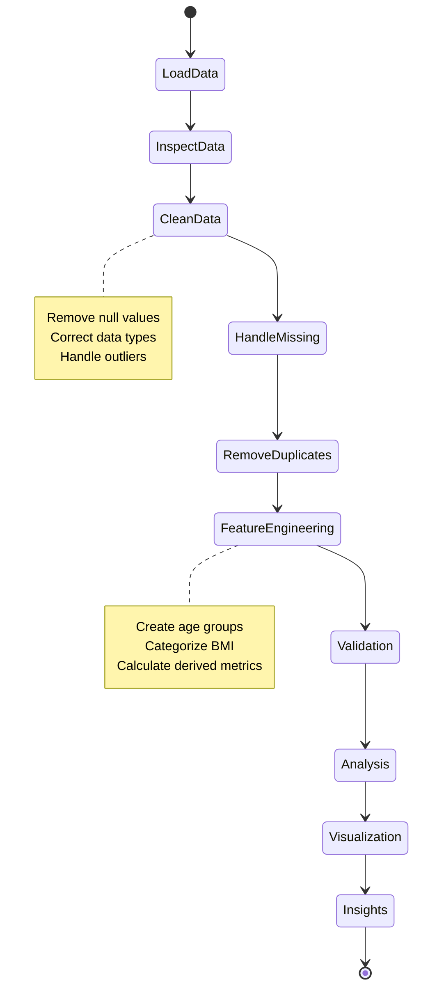

---

## 📝 Results Summary

### Key Discoveries

1. **✅ Strong Positive Correlation:** Sleep duration and quality (r = +0.88)
2. **⚠️ Negative Impact:** Stress significantly reduces sleep quality (r = -0.90)
3. **📊 Prevalence:** Sleep disorders affect nearly half the population (40-45%)
4. **💪 Lifestyle Factor:** Physical activity correlates with lower stress levels
5. **👥 Demographics:** Age and occupation influence sleep patterns

### Recommendations

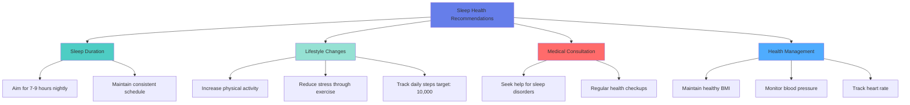

---

## 👥 Team Contributions

**Group 3 Members:**

| Member | Contribution | Focus Area |
|--------|--------------|------------|
| **Person 1** | Sleep patterns analysis | Duration & Quality metrics |
| **Person 2** | Lifestyle factors | Physical activity & Stress |
| **Person 3** | Health metrics | BMI, BP, Heart rate |
| **Person 4** | Data integration | Correlations & insights |

---

## 🛠️ Technologies Used

```mermaid
graph LR
    A[Technologies] --> B[Languages]
    A --> C[Libraries]
    A --> D[Tools]
    A --> E[Platform]
    
    B --> B1[Python 3.8+]
    
    C --> C1[Pandas]
    C --> C2[NumPy]
    C --> C3[Matplotlib]
    C --> C4[Seaborn]
    C --> C5[Scikit-learn]
    
    D --> D1[Jupyter Notebook]
    D --> D2[Git/GitHub]
    D --> D3[Google Colab]
    
    E --> E1[Kaggle]
    E --> E2[VS Code]
    
    style A fill:#667eea
    style B1 fill:#3776ab
    style C1 fill:#150458
    style C3 fill:#11557c
    style D1 fill:#f37626
```

---

## 📚 References

1. [Sleep Health and Lifestyle Dataset - Kaggle](https://www.kaggle.com/datasets/uom190346a/sleep-health-and-lifestyle-dataset)
2. [CDC - Sleep and Sleep Disorders](https://www.cdc.gov/sleep/)
3. [WHO - Sleep Guidelines](https://www.who.int/)
4. [National Sleep Foundation](https://www.sleepfoundation.org/)
5. [Python Data Science Handbook](https://jakevdp.github.io/PythonDataScienceHandbook/)

---

## 📄 License

This project is licensed under the MIT License - see the [LICENSE](LICENSE) file for details.

```
MIT License

Copyright (c) 2025 Prani897

Permission is hereby granted, free of charge, to any person obtaining a copy
of this software and associated documentation files.
```

---

## 🤝 Acknowledgments

- **Course Instructor:** CS661 - Pace University
- **Dataset Source:** Laksika Tharmalingam (Kaggle)
- **Tools:** Google Colab, Python, Pandas, Matplotlib, Seaborn
- **Team:** Group 3 Members for collaborative effort

---

## 📧 Contact

**Prani897**  
Pace University  
CS661 - Group 3

**GitHub:** [@Prani897](https://github.com/Prani897)  
**Project Link:** [https://github.com/Prani897/sleep-health-lifestyle-eda](https://github.com/Prani897/sleep-health-lifestyle-eda)

---

## 🌟 Project Stats


---

## 📈 Future Enhancements

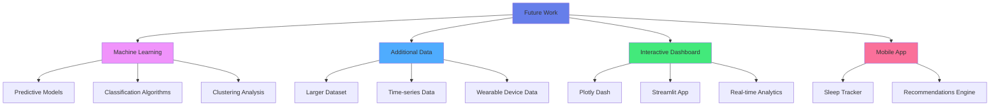

---

⭐ **If you find this project helpful, please give it a star!**

**Last Updated:** December 2025
